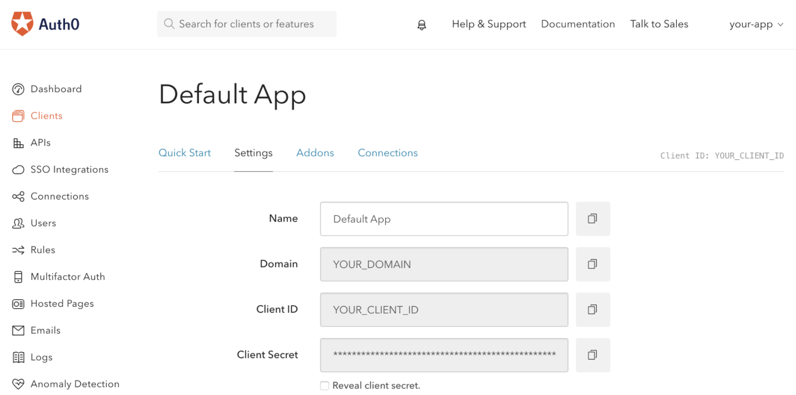
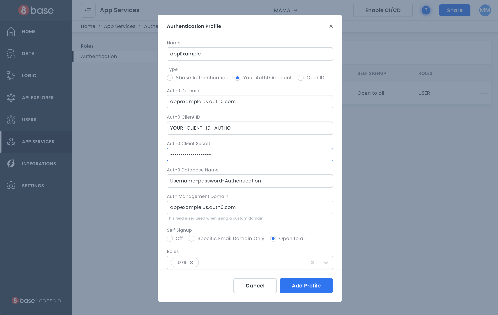

# Conventions for creating 8base applications

This is a proposal to document conventions and patterns for working with 8base.com platform

## 1. Apollo Client:

This pattern explains how to generate the reference for the Apollo Client:

 - Single way to obtain the reference to the apollo `client`
 - Compatible with the apollo Provider - Consumer Pattern
 - The Auth Token can't be store it in the local storage for security safety
 - Support for 8base subscriptions

>>> src/shared/apollo.ts
```javascript
import { BatchHttpLink } from 'apollo-link-batch-http';
import { HttpLink } from 'apollo-link-http';
import { ApolloLink } from 'apollo-link';
import { onError } from 'apollo-link-error';
import { ApolloClient } from 'apollo-client';
import { InMemoryCache } from 'apollo-cache-inmemory';
import { getMainDefinition } from 'apollo-utilities';
import { SubscriptionLink } from '@8base/apollo-links';
import { setContext } from 'apollo-link-context';
import { rollbar } from 'shared/rollbar';

const WORKSPACE_ENDPOINT = process.env.REACT_APP_WORKSPACE_ENDPOINT;
const WORKSPACE_ID = process.env.REACT_APP_WORKSPACE_ID;
const EIGHTBASE_WS_ENDPOINT = process.env.REACT_APP_8base_WS_ENDPOINT; //`wss://ws.8base.com`
const batchHttpLink = new BatchHttpLink({ uri });
const httpLink = new HttpLink({ uri });

const subscriptionLink = new SubscriptionLink({
    uri: EIGHTBASE_WS_ENDPOINT,
    getAuthState: () => ({ token, workspaceId, }),
    onAuthError: (error) => {
      console.log('apollo:subscriptionLink:log', '[Subscription error]:', error);
      rollbar.error('[Subscription error]:', error);
    },
});

const onErrorLink = onError(({ graphQLErrors, networkError }) => {
    if (graphQLErrors) {
      graphQLErrors.forEach(({ message, locations, path }) => {
        const errorMessage = `[GraphQL error]: Message: ${message}, Location: ${locations}, Path: ${path}`;
        rollbar.error(errorMessage);
        console.log('apollo:onErrorLink:log', errorMessage);
      });
    }
    
    if (networkError) {
      rollbar.error('[Network error]:', networkError);
      console.log('apollo:onErrorLink:log', '[Network error]:', networkError);
    }
});

const networkLink = ApolloLink.split(
    ({ query }) => {
      const definition = getMainDefinition(query);
      return definition.kind === 'OperationDefinition' && definition.operation === 'subscription';
    },
  subscriptionLink,
    ApolloLink.split(
      (operation) => operation.getContext().important === true,
      httpLink,
      batchHttpLink,
    ),
);
const cache = new InMemoryCache();

/**
**/
export function createApolloClient(getToken, headers={} ) {
  const authLink = setContext((_, { _headers }) => {
  const token = getToken();
  return {
           headers: {
             ..._headers,
             ...headers,
             authorization: token ? `Bearer ${token}` : '',
           },
         };
  });
 
  const client = new ApolloClient({
    link: ApolloLink.from([authLink, onErrorLink, networkLink]),
    cache,
  });

  return client;
}

```

## use as Provider
>>> src/Application.ts

```js
import React from 'react';
import { ApolloProvider } from '@apollo/client';
import { BrowserRouter } from 'react-router-dom';
import { createApolloClient } from './shared/apollo';
import { Routes } from './routes/routes';
import { Auth0ProviderWithHistory } from './shared/components/Auth0ProviderWithHistory';
import {OnAuthToken} from 'modules/auth/events'

export const Application: React.FC = () => {
  const client = createApolloClient(()=>OnAuthToken.get());
  return (
  <BrowserRouter>
    <Auth0ProviderWithHistory>
      <ApolloProvider client={client}>
        <Routes />
      </ApolloProvider>
    </Auth0ProviderWithHistory>
  </BrowserRouter>
  )
};

```

## Use for Actions
>>> src/modules/auth/auth-actions.ts
```js
import { createApolloClient } from './shared/apollo';
import {OnAuthToken} from 'modules/auth/events'

const createProject = ()=> {
     const client = createApolloClient(()=>OnAuthToken.get());
    ....
};
```

## 2. Invite users:

### For Users that are new to the platform:

When an email from an invitation doesn't exists in the platform, the ideal case is to programatically create the user in the Auth0 Database, ans then in 8base as a user in the User table. For this we use the Auth0 api to:

 - Create the user in Auth0 with the Auth0 api
 - Create the User on 8base database. 
 - Create an Auth0 "ticket" for changing the password with at least 1 month of expiration. 
 - This generates a Reset Password link that must be sent via email to the User, to facilitate the password setup.
 - And then we continue with the email invitation steps.

### Invitation steps:

- Create a table with the Invitation details: 
    * email: Of the user to be invited 
    * text: To show in the invitations email or dialog.  This has to be manually put here because new users usually don't have access to the entities to be connected
    * entity: The Entity to be connected. Client, company, etc
    * status: PENDING: for new created invitations, ACCEPTED for accepted invitations, REJECTED for rejected invitations
- The invitation should be sent by email with an *After Create Trigger*
- The email sent to the User must have a link to go to see his invitations (See next Item)
- The system should check when loading the Session, for *PENDING* invitations only to display to the user
- The invitation should be accepted in a Resolver to skip permissions when connecting the `user` to the `entity`. This is because the `user` at this point (before connected) should not be able to access the `entity`. Remember to check permission in the resolver before accepting the initation: 
     * The email of the user making the request to the Resolver must match the user being invited.
     * The invitation must be on a PENDING status.


## 3. Signup / Login with Auth0 

### Common
### For ReactJS
### For React Native

#### Create app Auth0 account

First we must login to Auth0 account and create a Native type application


#### You need the following information:
 - Domain
 - Client Id
 - Client Secret

#### Get Your Application Keys



Run
```shell script
npm i -S react-native-auth0
```

#### iOS
Then run in the ios folder
```shell script
pod install
```
In the file ios `ios/<YOUR PROJECT>/AppDelegate.m` add the following:

```swift
#import <React/RCTLinkingManager.h>

- (BOOL)application:(UIApplication *)app openURL:(NSURL *)url
            options:(NSDictionary<UIApplicationOpenURLOptionsKey, id> *)options
{
  return [RCTLinkingManager application:app openURL:url options:options];
}
```
Inside the `ios` folder open the `Info.plist` and locate the value for `CFBundleIdentifier`

```xml
<key>CFBundleIdentifier</key>
<string>$(PRODUCT_BUNDLE_IDENTIFIER)</string>
```

then below register a URL type entry using the value of `CFBundleIdentifier` as the value for the `CFBundleURLSchemes`:

```xml
<key>CFBundleURLTypes</key>
<array>
    <dict>
        <key>CFBundleTypeRole</key>
        <string>None</string>
        <key>CFBundleURLName</key>
        <string>auth0</string>
        <key>CFBundleURLSchemes</key>
        <array>
            <string>$(PRODUCT_BUNDLE_IDENTIFIER)</string>
        </array>
    </dict>
</array>
```


#### Android

In the file `android/app/src/main/AndroidManifest.xml` you must make sure the activity you are going to receive the authentication on has a launchMode value of `singleTask` and that it declares the following intent filter (see the React Native docs for more information):

```xml
<intent-filter>
    <action android:name="android.intent.action.VIEW" />
    <category android:name="android.intent.category.DEFAULT" />
    <category android:name="android.intent.category.BROWSABLE" />
    <data
        android:host="YOUR_DOMAIN"
        android:pathPrefix="/android/${applicationId}/callback"
        android:scheme="${applicationId}" />
</intent-filter>
```

#### Configure Callback URLs inside Auth0 Account

A callback URL is a URL in your application where Auth0 redirects the user after they have authenticated.

The callback URL for your app must be added to the Allowed Callback URLs field in your `Application Settings`. If this field is not set, users will be unable to log in to the application and will get an error.

##### iOS callback URL  


```
{PRODUCT_BUNDLE_IDENTIFIER}://YOUR_DOMAIN/ios/{PRODUCT_BUNDLE_IDENTIFIER}/callback
```

##### Android callback URL  


```
{YOUR_APP_PACKAGE_NAME}://YOUR_DOMAIN/android/{YOUR_APP_PACKAGE_NAME}/callback
```

#### Configure the workspace 8base account

Having completed the previous steps, we must go to the `workspace` of the 8base account and in `app services -> authentication` create an authentication profile like this:



#### Add authentication with Auth0

First, import the `Auth0` module and create a new `Auth0` instance.

```javascript
import Auth0 from 'react-native-auth0';
const auth0 = new Auth0({ domain: 'YOUR_DOMAIN', clientId: 'YOUR_CLIENT_ID' });

const loginAuth = () => {
  auth0
    .webAuth
    .authorize({scope: 'openid profile email'})
    .then(credentials =>
      // Successfully authenticated
      // Store the accessToken
      this.setState({ accessToken: credentials.accessToken })
    )
    .catch(error => console.log(error));
}

const logoutAuth = () => {
  auth0.webAuth
    .clearSession({})
    .then(success => {
        Alert.alert(
            'Logged out!'
        );
        this.setState({ accessToken: null });
    })
    .catch(error => {
        console.log('Log out cancelled');
    });
}
```


### Additional fields for Auth0 Signup

TODO:

## 4. 8base database modeling

As a general rule, we use lower camel case for naming any field in the database. 

### General Rules

- Do not use multiple fields for attributes, these are not searchable yet (Dec, 2020)
- Do not use Many to Many relationships, use a separate table always. This make the application easier to be modified
- Use Mandatory fields for relationships where it is required a cascade effect. Mandatory fields force the data to be erased when the related object is deleted

### Naming relationships: 

8base allow naming reverse relationship fields, and for that, we have a convention:

#### For the Many to One relation:

- For the reference field: `<Entity Name>`
- For the reverse relationship field: `<Entity Name><Related Table Name>Relation`

Example: Given EntityA and EntityB as Tables, a field on EntityA, that makes a reference to EntityB, must be called:

- `entityB` for the reference
- `entityBEntityARelation` for the reverse reference

#### For the One to One relation

- For the reference field: `<Entity Name>`
- For the reverse relationship field: `<Entity Name>`

Example: Given EntityA and EntityB as Tables, a field on EntityA, that makes a reference to EntityB, must be called:

- `entityB` for the reference
- `entityA` for the reverse reference

## 5. Deleting heavy objects (Objecct with lots of relationships)
