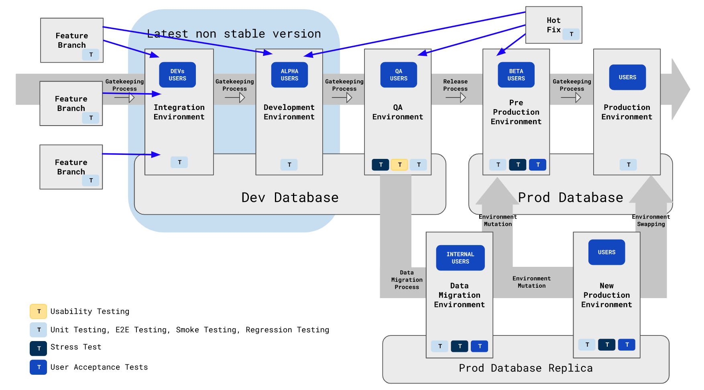

Here we show a proposed approach for managing deployment environments using Git branches, and how the flow of the code for these branches should be conditioned.

This diagram is being base on my experience developing web applications, and the [Feature Branch](https://www.atlassian.com/git/tutorials/comparing-workflows/feature-branch-workflow) Approach proposed by Atlassian.

# General considerations:

- Every environment should have automated E2E tests, Regression Tests, and Unit Tests.
- Every Branch/Environment should have a gate keeper process, policy, person to fulfill a policy or todo list before it gets updated.
- Feature Branches start from the left and are promoted to the right by the gate keeping processes, policies or people.
- Hot Fixes branches start from the environment where they were identified and move to the left to update the previous environments.
- There should be no downtime for the production environment, pre production environment or qa environment.
- Production database should be regularly backed up.
- Pipeline should be automated and be kept active at all times. Ideally making daily deployments and releases.

# Branches / Environments:

## Feature Branch

- Feature branches are branches exclusively to work on new features or enhancements to a stable version of the system.
- Normally but not always these branches should be created from the Production branch and its integration process should start at the `Integration Environment`.

## Hot Fix Branch

- Hot fixes branches are created to fix or repair issues or bugs. They are created from the far most right branch where they were identified.
- Once completed and integrated in the environment where they were initially required, they need to be integrated in previous environments.

## Integration Environment

- The integration environment is a branch where features are tested primarily for Regression Problems before they are promoted to the Development Environment.
- This may be an environment, or a process or both where a validation is performed to test that the new merged features work properly with other new features.
- **Gate keeping conditions:**
    - Passed E2E Tests, unit tests and regression tests in the Feature Branch environment.
    - Passed Code Review process for at least 1 code owner.

## Development Environment

- This is the environment where all the new features initially get published.
- Usually called `dev` branch or `master` branch is a physical environment where the developers can see their features under production like circumstances.
- **Gate keeping conditions:**
    - Passed E2E Tests, unit tests and regression tests in the Integration Environment.
    - Passed Code Review process for at least 1 code owner

## QA Environment

- This is the environment where the QA team can perform functional tests on the new merged features.
- This environment is separate from development with the purpose of being isolated from integration issues.
- **Gate keeping conditions:**
    - Passed E2E Tests, unit tests and regression tests in the Development Environment.
    - Passed Code Review process for at least 1 code owner
    - Features are clear out to be promoted to start testing by the QA team.

## Pre-Production Environment or Staging Environment

- This environment has the latest tested features by the QA team, and can be exposed to real users for approvals or for Beta programs.
- **Gate keeping conditions:**
    - Passed E2E Tests, unit tests and regression tests in QA Environment.
    - Passed Code Review process for at least 1 code owner
    - Passed QA Testing according to Acceptance Criteria

## Data Migration Environment

- This environment is created when a change on the live Production Data is required.
- A representative subset copy of the production data is required in order to simulate production conditions.
- In this environment the `Data Migration Process` is tested.
- **Gate keeping conditions:**
    - Passed E2E Tests, unit tests and regression tests in QA Environment.
    - Passed Code Review process for at least 1 code owner
    - Passed QA Testing according to Acceptance Criteria

## Production Environment

- This is the most stable environment / branch where the pre-production updates get promoted to made publicly available the new features and fixes of the system.
- **Gate keeping conditions:**
    - Passed E2E Tests, unit tests and regression tests in the Pre-production Environment
    - Passed Code Review process for at least 1 code owner
    - Passed User Acceptance Tests
- **Additional gate keeping steps:** Considering that the update of this environment may only come from 3 different processes:
    - **1) Promoting the Pre-Production Environment:**
        - Promote Pre-Production Environment.
        - Perform E2E tests, unit tests, regression tests and User Acceptance Tests.
        - Smoke tests on Production Environment.
    - **2) Environment Mutation:**
        - Promote Pre-Production Environment.
        - Execute the `Data Migration Process` on the Production Environment.
        - Perform E2E tests, unit tests, regression tests and User Acceptance Tests.
        - Smoke tests on Production Environment.
    - **3) Environment Swapping:**
        - Replicate the Production Environment to a New Production Environment.
        - Perform E2E tests, unit tests, regression tests and User Acceptance Tests on the New Production Environment.
        - Smoke tests on the New Production Environment.
        - Execute the `Data Migration Process` on the New Production Environment.
        - Perform E2E tests, unit tests, regression tests and User Acceptance Tests on the New Production Environment.
        - Smoke tests on the New Production Environment.
        - Swap Environments and make the New Production Environment replace the Production Environment.
        - Perform E2E tests, unit tests, regression tests and User Acceptance Tests on the Production Environment.
        - Smoke tests on the Production Environment.

    
