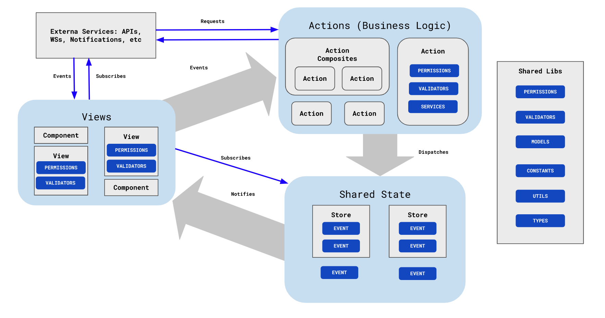

## **Frontend Applications Architecture**

### **Views or Container or Controller:** 

A view is a component that is responsible for rendering the UI. A view can be a page, a modal, a dialog, etc. A view has access to the state of the application to make decision in what to display to the user

### **Component o Presentational Component:** 

A component is a UI element who's only responsibility is to render the UI. A component can be a button, a text input, a table, etc. A component can have a state to optimize the rendering of the UI.

### **Store:**

A store is one or multiple places where the current state of the application is held. The store itself can be divided in multiple places to logically separate the state of the system.

### **Actions:**

An action is a function that is responsible for modifying the state of the application. An action can be a simple function that modifies the state of the application or a complex function that calls other actions. It can also be a Service function that calls an API.

### General Conventions
1) Unidirectional flow always: View -> Actions -> Store -> View
2) **Presentational Components** subscribes to changes in any application level state or **store**
3) **Actions** can dispatch events that modify the state of the **store**
4) **Presentational components** can trigger **actions** that affect the state of the **store**
5) **Actions** can be combined in to more complex **actions**
6) **Store** propagates changes to all subscribers
7) Consistency checks must always throw errors:
    - A view can't subscribe to an event or change that does not exist.
    - An action can never dispatch an event or change that doesn't exist.
    - A store can't handle data of an event or change that does not exist.

### **View Conventions:**
1) A view can check permissions
2) A view can check validations
3) A view can only be updated as a result of a state change.
4) A view can't handle promises lifecycles rather it must rely on notifications and subscriptions to "react" to events.

### **Store Conventions:**
1) A store is defined by one or more logically grouped events.
2) Every possible event in the application must be declared either on a declarative or programmatically way.
3) An application must have logically separated stores.
4) The store state can only be modified `dispatching` events.
5) Any part of the application can have read only access to the application level current state or **stores**

### **Actions Conventions:**
1) An action has to logically represent a business activity with a specified outcome.
2) It's self-contained: validation, permissions, services.
3) It's a black box for its consumers.
4) Composable: It may consist of other underlying actions or services.
5) Pure: Other than the application state via `dispatch`, the action can't access or modify external state.

### **Permission Conventions:**
1) A Permission must be pure javascript function.
2) Permissions can be composable.

### **Validation Conventions**
1) A Validation must be pure javascript function.
2) Validations can be composable.
